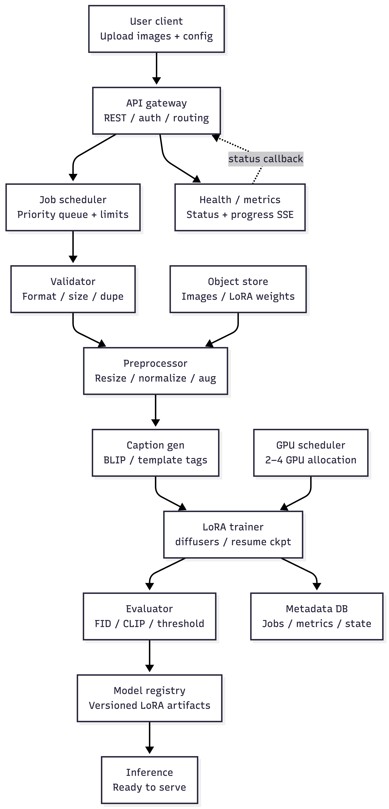

# Automatic LoRA Training Pipeline

## System Architecture



## Technical Specification

### Detailed Component Descriptions

**API Gateway**
The single entry point for all client interactions. Responsible for authenticating requests, validating inputs, routing to downstream services, and returning structured responses. Expose both synchronous REST endpoints and a real-time progress stream. Remain stateless so it can be horizontally scaled independently of the training workers.

**Job Scheduler**
Manage the lifecycle of training jobs under constrained GPU resources. Accept incoming job requests, places them in a priority queue, and dispatch them to available workers. Enforce concurrency limits to prevent GPU memory contention. Responsible for tracking job state transitions: pending $\rightarrow$ processing $\rightarrow$ training $\rightarrow$ evaluating $\rightarrow$ completed / failed.

**Data Processor**
Transforms raw user-uploaded images into a clean, model-ready dataset. Responsible for quality filtering, deduplication, normalization, text annotation, data augmentation, and dataset splitting. Be deterministic given the same inputs and seed, and produce output in a format directly consumable by the training component.

**LoRA Trainer**
Train a LoRA on top of a frozen base diffusion model using the processed dataset. Accept a configurable set of hyperparameters. Support periodic checkpointing so that training can be interrupted and resumed without data loss.

**Evaluator**
Assess the quality of a trained LoRA model by generating sample images and scoring them against defined quality metrics. Compare generated outputs to both the text prompts (semantic alignment) and the original training distribution (visual fidelity). Apply configurable thresholds to determine whether a model meets the minimum quality bar for deployment.

**Checkpoint Manager**
Persist training state at regular intervals so that jobs can recover from interruptions. Manage storage of model weights and optimiser state. Enforce a retention policy to bound disk usage, retaining only the most recent N checkpoints.

**Model Registry**
Store versioned, deployment-ready model artifacts. Each entry is associated with metadata including the job that produced it, the training configuration, and the evaluation metrics at the time of registration. Serve as the handoff point between the training pipeline and the inference system.


### API Specifications

| Method | Endpoint | Description |
|--------|----------|-------------|
| `POST` | `/jobs` | Submit images + config, start training job |
| `GET` | `/jobs/{job_id}` | Poll job status and result |
| `GET` | `/jobs` | List all jobs (paginated) |
| `DELETE` | `/jobs/{job_id}` | Cancel a running job |
| `GET` | `/jobs/{job_id}/progress` | SSE stream of training steps |
| `POST` | `/evaluate` | Evaluate an existing model |
| `POST` | `/ab-test` | Compare two models |
| `GET` | `/health` | Service health + GPU availability |
| `GET` | `/metrics` | Prometheus-format operational metrics |


### Data Models and Schemas

**TrainingRequest** — parameters supplied by the user at job submission
 
| Field | Type | Description |
|-------|------|-------------|
| `trigger_word` | string | The token representing the trained concept |
| `base_model_id` | string | Identifier of the base diffusion model |
| `lora_rank` | integer | Rank of the low-rank adapter matrices |
| `learning_rate` | float | Optimiser learning rate |
| `num_epochs` | integer | Number of full passes over the training set |
| `target_size` | integer | Image resolution used during training (pixels) |
 
**ImageRecord** — represents a single image after processing
 
| Field | Type | Description |
|-------|------|-------------|
| `path` | string | Location of the processed image file |
| `caption` | string | Text annotation associated with the image |
| `split` | string | Dataset partition: `train` / `val` / `test` |
| `is_augmented` | boolean | Whether this is a synthetically generated variant |
 
**JobRecord** — tracks the state of a training job
 
| Field | Type | Description |
|-------|------|-------------|
| `job_id` | string | Unique job identifier |
| `status` | enum | `pending` / `processing` / `training` / `evaluating` / `completed` / `failed` |
| `progress` | object | Current stage and completion percentage |
| `result` | object | Populated on successful completion |
| `error` | string | Populated on failure, null otherwise |
 
**TrainingStep** — single progress event emitted during training
 
| Field | Type | Description |
|-------|------|-------------|
| `step` | integer | Global step count |
| `epoch` | integer | Current epoch |
| `loss` | float | Training loss at this step |
| `lr` | float | Current learning rate |
| `elapsed_seconds` | float | Wall-clock time since training started |
 
**EvalMetrics** — output of the evaluation component
 
| Field | Type | Description |
|-------|------|-------------|
| `clip_score` | float | Semantic alignment between generated images and prompts |
| `fid_score` | float / null | Distributional distance from real training images; null if unavailable |
| `passes_threshold` | boolean | Whether the model meets minimum quality requirements |
 
**TrainingResult** — final output of a completed training job
 
| Field | Type | Description |
|-------|------|-------------|
| `job_id` | string | Identifier of the originating job |
| `model_path` | string | Location of the saved model artifact |
| `final_loss` | float | Training loss at the last step |
| `summary` | object | Total steps, duration, and training configuration |
| `success` | boolean | Whether training completed without error |
| `error` | string | Error message if success is false, null otherwise |


### Error Handling Strategies

**Input validation**
All inputs are validated at the API boundary before any processing begins. Invalid file formats, out-of-range parameter values, and malformed requests are rejected immediately with a descriptive error response. Jobs are never created for requests that fail validation.

**Image-level rejection**
Individual images that fail quality checks are silently excluded from the dataset rather than failing the entire job. The job proceeds as long as the remaining valid image count meets the minimum threshold. If the valid set falls below the minimum, the job is terminated with a clear explanation of how many images were rejected and why.

**Job-level failures**
Any failure during processing, training, or evaluation transitions the job to a failed state and records the cause. The failure is propagated to the client via the SSE stream as a terminal event. Failures in one job must not affect other running or queued jobs.

**Interrupted training**
Training jobs that are interrupted mid-run must be resumable from the most recent checkpoint. The system should detect the presence of a prior checkpoint on startup and continue from that point rather than restarting from scratch.

**Resource exhaustion**
When GPU memory is insufficient to run a job with the requested configuration, the job should fail with an actionable error message suggesting configuration adjustments (e.g. reducing batch size or image resolution) rather than crashing the service.

## Implementation
 
### Project Structure
 
```
lora_pipeline/
├── api/
│   └── main.py              REST API — job management, SSE streaming, health endpoints
├── pipeline/
│   ├── processor.py         Data validation, preprocessing, captioning, splitting
│   ├── trainer.py           LoRA training loop, checkpointing, GPU management
│   └── evaluator.py         CLIP score, FID, A/B testing framework
├── tests/
│   └── test_pipeline.py     Unit tests and performance benchmark
├── Dockerfile
├── docker-compose.yml
└── requirements.txt
```
 
### Data Processing
 
Raw uploaded images go through a sequential pipeline before training begins:
 
1. **Validation** — format check, minimum resolution (256×256), file integrity, blur detection
2. **Deduplication** — hash-based comparison to remove identical images across the upload batch
3. **Preprocessing** — center-crop to square, resize to target resolution, RGB normalisation
4. **Captioning** — filename-derived description combined with the trigger word; can be swapped for a BLIP or CogVLM call for richer annotations
5. **Augmentation** — horizontal flip, ±10° rotation, brightness jitter to expand the effective dataset size
6. **Splitting** — deterministic 85 / 10 / 5 train / val / test split, seed-controlled for reproducibility
7. **Caption files** — `.txt` sidecars written alongside each image following the diffusers training convention

### Training
 
LoRA adapters are injected into the UNet attention layers of a frozen Stable Diffusion base model. Training uses AdamW with a cosine learning rate schedule. Key configuration defaults:
 
| Parameter | Default | Notes |
|-----------|---------|-------|
| `base_model_id` | `runwayml/stable-diffusion-v1-5` | Any diffusers-compatible model accepted |
| `lora_rank` | `16` | Higher rank = more parameters |
| `lora_alpha` | `rank × 2` | Derived automatically |
| `learning_rate` | `1e-4` | |
| `num_epochs` | `100` | |
| `target_size` | `512` | 256–1024px |
| `batch_size` | `1` | System-managed based on available VRAM |
 
### Evaluation
 
Trained models are automatically evaluated before being marked as complete. A model must pass both thresholds to be promoted to the registry:
 
| Metric | Tool | Passing threshold |
|--------|------|-------------------|
| CLIP score | openai/clip ViT-B/32 | ≥ 0.20 |
| FID | clean-fid / torch-fidelity | ≤ 200 |
 
Install optional dependencies for full evaluation:
 
```bash
pip install openai-clip clean-fid
```
 
Without them, CLIP falls back to a calibrated stub and FID is skipped. The quality gate still applies to CLIP score alone.
 
### Resource Management
 
The pipeline is designed to operate within a 2–4 GPU constraint without modification:
 
- **fp16 mixed precision** halves VRAM usage with negligible quality impact
- **Gradient checkpointing** trades ~25% training speed for significant memory reduction, allowing larger resolutions on consumer GPUs
- **Serial job queue** prevents multiple concurrent jobs from competing for GPU memory and causing OOM failures
- **Automatic checkpointing** every N steps enables recovery from preemption on spot instances without restarting training
- **Checkpoint pruning** retains only the 3 most recent checkpoints to bound disk usage
For scaling beyond 4 GPUs, replace `BackgroundTasks` with a Celery worker pool and use `accelerate launch --num_processes N` for distributed training.

 
**Submitting a job**
 
```bash
curl -X POST http://localhost:8000/jobs \
  -F "files=@image1.jpg" \
  -F "files=@image2.jpg" \
  -F 'config={"trigger_word":"sks","lora_rank":16,"num_epochs":100}'
```
 
```json
{"job_id": "abc123", "status": "pending"}
```
 
**Streaming live progress**
 
```bash
curl -N http://localhost:8000/jobs/abc123/progress
```
 
```
event: step
data: {"step": 200, "epoch": 2, "loss": 0.142, "lr": 9.8e-05, "elapsed_seconds": 45.2}
 
event: done
data: {"status": "completed", "result": {...}}
```
 
## Setup and Deployment
 
### Local
 
```bash
pip install -r requirements.txt
uvicorn api.main:app --reload
```
 
### Docker
 
```bash
docker compose up --build
```
 
The API is available at `http://localhost:8000` in both cases.
 
## Testing and Benchmarks
 
### Unit tests
 
```bash
python -m pytest tests/test_pipeline.py -v
```

| Module | Tests | Result |
|--------|-------|--------|
| Image validation | 7 | Pass |
| Image preprocessing | 5 | Pass |
| Caption generation | 3 | Pass |
| Dataset splitting | 3 | Pass |
| Data processor (end-to-end) | 4 | Pass |
| GPU memory manager | 3 | Pass |
| Checkpoint manager | 2 | Pass |
| LoRA trainer | 2 | Pass |
| CLIP scorer | 2 | Pass |
| Model evaluator | 2 | Pass |
| A/B test framework | 2 | Pass |
| API endpoints | 6 | Pass |
| **Total** | **41** | **41/41** |

```bash
# if CPU
python -m pytest tests/test_pipeline.py -v -k "not GPU and not Trainer and not CLIP and not Evaluator and not ABTest and not API and not Checkpoint"
````

### End-to-end pipeline validation
 
The full automatic pipeline was validated by submitting a real job via the API. The complete flow — image upload $\rightarrow$ data processing $\rightarrow$ training $\rightarrow$ evaluation:
 
```bash
curl -X POST http://localhost:8000/jobs \
  -F "files=@img_0.jpg" \
  -F "files=@img_1.jpg" \
  -F "files=@img_2.jpg" \
  -F "files=@img_3.jpg" \
  -F "files=@img_4.jpg" \
  -F "files=@img_5.jpg" \
  -F 'config={"trigger_word":"sks","num_epochs":1}'
```
 
Observed job result:
 
```json
{
    "job_id": "edd8eb3252354684b5f87f3f0fb93c00",
    "status": "completed",
    "result": {
        "model_path": "outputs/edd8eb3252354684b5f87f3f0fb93c00/models/edd8eb3252354684b5f87f3f0fb93c00",
        "summary": {
            "total_steps": 17,
            "duration_seconds": 25.56,
            "config": {
                "base_model_id": "runwayml/stable-diffusion-v1-5",
                "lora_rank": 16,
                "lora_alpha": 32,
                "learning_rate": 0.0001,
                "num_train_epochs": 1,
                "train_batch_size": 1
            }
        },
        "metrics": {
            "clip_score": 0.277,
            "fid_score": null,
            "passes_threshold": true
        },
        "passes_quality_threshold": true,
        "data_stats": {
            "total_input": 6,
            "accepted": 6,
            "augmented": 12,
            "rejected": 0,
            "train": 17,
            "val": 0,
            "test": 1
        }
    }
}
```
